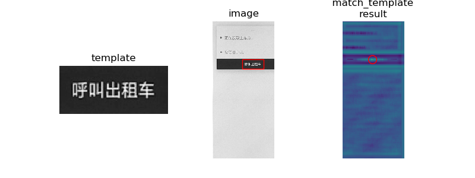
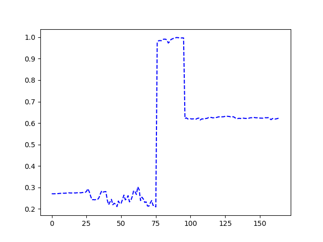

# stagesep

[](https://codeclimate.com/github/williamfzc/stagesep/maintainability)

> 利用OCR与图像识别，检测出视频中的阶段

## 效果

通过使用stagesep，你可以将一段视频中每一帧的特征提取出来，生成数据供后续分析。

你只需要：

```python
# 导入视频
ssv = stagesep.load_video('res/demo_video.mp4')

# 分析视频
result = stagesep.analyse_video(ssv)
```

就能够将视频中的特征提取出来！以`|,,|`为分隔符，分别为：

- 帧编号
- 帧对应的视频时间
- 当前帧包含的文字
    - 如结果为`["微信"]`，代表当前帧中出现了`微信`字样
    - 可以借此得到视频的不同阶段
- 与首帧的图像相似度
    - 可以得到开始出现变化的时刻
- 与末帧的图像相似度
    - 可以得到进入稳态的时刻
- 当前帧是否存在特征图片
    - 例如，传入一张特征图片，是一个表情包
    - 如果结果为`[[0, 0.27060889074688604]]`，两个参数分别代表：
        - 当前帧没有出现该表情包
        - `match_template`的结果为0.27
    - 适合在没有文字的场景下进行阶段界定

```bash
1|,,|0.03333333333333333|,,|["Component\u79d2\u5f00"]|,,|1.0|,,|0.8744666747566574|,,|[[0, 0.27060889074688604]]
2|,,|0.06666666666666667|,,|["\u6ef4\u6ef4\u51fa\u884c\u79d2\u5f00", "Component\u79d2\u5f00"]|,,|0.9945336759012924|,,|0.8732500535811166|,,|[[0, 0.2702154980448374]]
3|,,|0.1|,,|["\u6ef4\u6ef4\u51fa\u884c\u79d2\u5f00", "Component\u79d2\u5f00"]|,,|0.9906519049687903|,,|0.8724468661392125|,,|[[0, 0.27054042596336]]
4|,,|0.13333333333333333|,,|["Component\u79d2\u5f00"]|,,|0.988436570914413|,,|0.8721808443349266|,,|[[0, 0.2707208582528737]]
5|,,|0.16666666666666666|,,|["Component\u79d2\u5f00"]|,,|0.9871368443037327|,,|0.8719868653399506|,,|[[0, 0.27088961169977555]]
6|,,|0.2|,,|["Component\u79d2\u5f00"]|,,|0.9859772325311379|,,|0.8717396593736755|,,|[[0, 0.271510313888945]]
7|,,|0.23333333333333334|,,|["\u6ef4\u6ef4\u51fa\u884c\u79d2\u5f00", "Component\u79d2\u5f00"]|,,|0.9853347906343617|,,|0.8714577411208654|,,|[[0, 0.272172863024542]]
8|,,|0.26666666666666666|,,|["\u6ef4\u6ef4\u51fa\u884c\u79d2\u5f00", "Component\u79d2\u5f00"]|,,|0.9851302157674813|,,|0.8715705722879807|,,|[[0, 0.27234378435162576]]
9|,,|0.3|,,|["Component\u79d2\u5f00"]|,,|0.9837414105243203|,,|0.8715590796786445|,,|[[0, 0.273214648246217]]
10|,,|0.3333333333333333|,,|["Component\u79d2\u5f00"]|,,|0.9838234965397075|,,|0.8716437205735402|,,|[[0, 0.27276039086080933]]
```

每一帧会对应一行数据。

## 使用

更详细的方法的使用参考[`demo.py`](https://github.com/williamfzc/stagesep/blob/master/demo.py)。

## 安装

```bash
pip install -r requirements.txt
```

同时需要在PC上安装tesseract，详见https://github.com/tesseract-ocr/tesseract/wiki

安装完成后在命令行中输入：

```bash
tesseract
```

如果能正常打印出内容说明已经安装成功。另外包含中文文本的视频需要从[这里](https://github.com/tesseract-ocr/langdata)下载语言包。

## 相关原理

### 图像相似度

- 统一使用SSIM进行图像相似度匹配
- 直接使用`skimage`提供的方法`compare_ssim`

相似度变化趋势是规律的，基本符合应用加载流程。


### OCR

就目前来看，词数趋势难以自动化地反映问题。


但可以作为后续分析的重要依据。

### 特征匹配

- opencv与skimage均提供了`match_template`方法供使用。目前直接使用skimage提供的方法。
- 算法：Fast Normalized Cross-Correlation，详见[这里](http://scikit-image.org/docs/dev/auto_examples/features_detection/plot_template.html)



可以看到，对于特征的识别效果显著：



## TODO

- [x] jieba分词对OCR结果进一步分析
    - OCR得到的结果通常是不规则的句子
    - 使用分词后数据会变得更规范

- [ ] 从相似度变化趋势中提取阶段
    - 就目前情况来看，当前帧与首尾帧的相似度变化趋势是有规律的

- [x] 关键点过滤
    - 假设我们需要在某段视频中找出会出现某个物体的部分帧
    - 传入该物体的特征图片（如果需要的是一个按钮，那么就是这个按钮的截图
    - 启动分析，结果中将会多出一列bool说明该帧中是否出现了该物体

## 关联与依赖

- [opencv](https://opencv-python-tutroals.readthedocs.io/en/latest/py_tutorials/py_tutorials.html): 图像与视频处理
- [tesseract](https://github.com/tesseract-ocr/tesseract/wiki/Downloads): OCR
- [skimage](https://github.com/scikit-image/scikit-image): 图片相似度

## License

MIT
