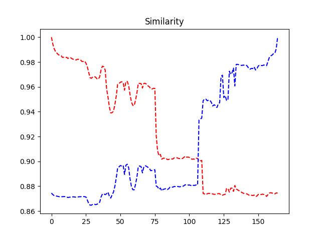

# stagesep

[](https://codeclimate.com/github/williamfzc/stagesep/maintainability)

> 利用OCR与图像识别，检测出视频中的阶段

## 安装

```bash
pip install -r requirements.txt
```

同时需要在PC上安装tesseract，详见https://github.com/tesseract-ocr/tesseract/wiki

安装完成后在命令行中输入：

```bash
tesseract
```

如果能正常打印出内容说明已经安装成功。另外中文视频需要从[这里](https://github.com/tesseract-ocr/langdata)下载语言包。

## 使用

```python
import stagesep
import json


# 导入视频
stagesep_object = stagesep.load_video('res/demo_video.mp4')

# 主要用于规范视频，用于调整fps与旋转视频
# 这里的rotate_time指的是逆时针90的旋转次数，3即向逆时针旋转270度，以此类推
stagesep_object = stagesep.rebuild_video(stagesep_object, new_fps=30, rotate_time=3)

# 查看一些基本信息
print(stagesep_object.fps)

# 获取视频分析结果
# 可以直接根据这个list分析
result = stagesep.analyse_video(stagesep_object, lang='chi_sim', real_time_log=True)

# 也可以根据生成的文件进行分析
with open('output/1535442458.txt', encoding='utf-8') as f:
    for line in f:
        frame_id, time_stamp, result = line.split('|,,|')
        result = json.loads(result)
        print(result)

```

## 效果

以`|,,|`为分隔符，分别为帧编号、对应的时间、识别到的文字、与首帧的相似度、与末帧的相似度。

```bash
1|,,|0.03333333333333333|,,|["Component\u79d2\u5f00"]|,,|1.0|,,|0.8744666747566574
2|,,|0.06666666666666667|,,|["\u6ef4\u6ef4\u51fa\u884c\u79d2\u5f00", "Component\u79d2\u5f00"]|,,|0.9945336759012924|,,|0.8732500535811166
3|,,|0.1|,,|["\u6ef4\u6ef4\u51fa\u884c\u79d2\u5f00", "Component\u79d2\u5f00"]|,,|0.9906519049687903|,,|0.8724468661392125
4|,,|0.13333333333333333|,,|["Component\u79d2\u5f00"]|,,|0.988436570914413|,,|0.8721808443349266
5|,,|0.16666666666666666|,,|["Component\u79d2\u5f00"]|,,|0.9871368443037327|,,|0.8719868653399506
6|,,|0.2|,,|["Component\u79d2\u5f00"]|,,|0.9859772325311379|,,|0.8717396593736755
7|,,|0.23333333333333334|,,|["\u6ef4\u6ef4\u51fa\u884c\u79d2\u5f00", "Component\u79d2\u5f00"]|,,|0.9853347906343617|,,|0.8714577411208654
8|,,|0.26666666666666666|,,|["\u6ef4\u6ef4\u51fa\u884c\u79d2\u5f00", "Component\u79d2\u5f00"]|,,|0.9851302157674813|,,|0.8715705722879807
9|,,|0.3|,,|["Component\u79d2\u5f00"]|,,|0.9837414105243203|,,|0.8715590796786445
10|,,|0.3333333333333333|,,|["Component\u79d2\u5f00"]|,,|0.9838234965397075|,,|0.8716437205735402
11|,,|0.3666666666666667|,,|["GComponent\u79d2\u5f00"]|,,|0.9834996685213664|,,|0.871615143975202
12|,,|0.4|,,|["Gomponent\u79d2\u5f00"]|,,|0.9838403582426749|,,|0.8712865474825727
```

## 相似度变化

统一使用SSIM进行相似度匹配。

### 与视频首帧尾帧的相似度变化趋势



### 文字识别出来的词数变化趋势


## TODO

- jieba分词对ocr结果进一步分析
- 从相似度变化趋势中提取阶段

## 关联与依赖

- [opencv](https://opencv-python-tutroals.readthedocs.io/en/latest/py_tutorials/py_tutorials.html): 图像与视频处理
- [tesseract](https://github.com/tesseract-ocr/tesseract/wiki/Downloads): OCR
- [skimage](https://github.com/scikit-image/scikit-image): 图片相似度

## License

MIT
